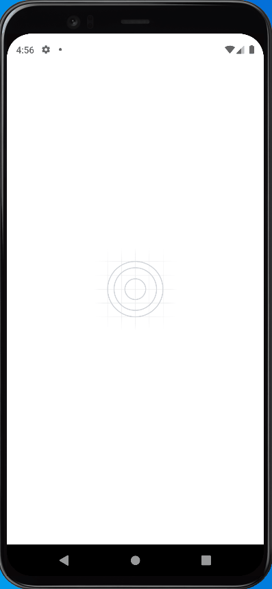

<h1 align="center">Interface - APP Financias</h1>

Aplicação desenvolvida em React-Native  com expo  de uma interface de Financias inspirada no APP do NuBank

<a href="#sobre">Sobre</a> .
<a href="#tecnologia">Tecnologia</a> .
<a href="#comoexecutar">Como executar</a> .
<a href="#styles">Styles</a>

 

# Sobre

Interface desenvolvida baseada no app nubank, utilizei o expo e react-native para isso e o moti para as animaçoes

 

# Tecnologia

<h3>HTML<h3>
<h3>CSS<h3>
<h3>React<h3>
<h3>React-Native<h3>
<h3>JavaScript<h3>

<h2>ferramentas</h2>
<h3>Moti<h3>
<h3>Expo<h3>
<h3>expo/vector-icons<h3>
 

# ComoExecutar

<h4>Clone loca<h4>
<h4>npm instal<h4>
<h4>expo start<h4>
<h4>Tenha um emulador Android ou IOS<h4>
 

# Styles

<h1 align="center">
    
</h1>

<h1 align="center">
    
</h1>
